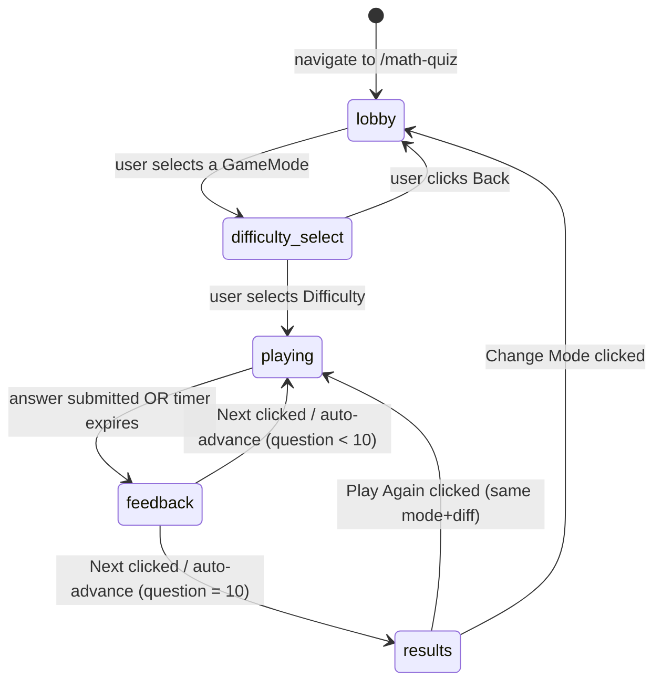

# Design Document — Math Quiz Game

## Overview

The Math Quiz Game is a self-contained Angular 18 feature mounted at `/math-quiz`. It is implemented as a single host component (`MathQuizGameComponent`) that drives an internal state machine to render one of four view-components: mode selection, difficulty selection, game screen, or results screen. All question generation is delegated to `QuestionEngine` (a service), session state to `SessionService`, and persistence to `PersonalBestService` (which wraps the existing `LocalStorageService`). Sound feedback reuses the existing `SoundService`.

No new libraries are added. All components are Angular 18 standalone. The feature registers itself in `app.routes.ts` and `GameRouteService`.

---

## Architecture

### High-Level Component Tree

```
MathQuizGameComponent  (host, state machine, route: /math-quiz)
├── ModeSelectComponent          (GameState = lobby)
├── DifficultySelectComponent    (GameState = difficulty-select)
├── GameScreenComponent          (GameState = playing | feedback)
│   ├── TimerBarComponent
│   ├── TypedAnswerComponent     (answerType = typed)
│   └── MultipleChoiceComponent  (answerType = multiple-choice)
│   └── FeedbackOverlayComponent (GameState = feedback)
└── ResultsComponent             (GameState = results)
```

### Service Layer

```
QuestionEngine          – pure question generation, no state
SessionService          – mutable session state (score, timer, index)
PersonalBestService     – localStorage read/write via LocalStorageService
SoundService            – (existing, shared) audio playback
LocalStorageService     – (existing, shared) typed localStorage wrapper
```

### State Machine Diagram



---

## Components and Interfaces

### MathQuizGameComponent

**File:** `src/app/math-quiz/math-quiz-game.component.ts`

Responsibilities:
- Owns `gameState: GameState` signal
- Owns `selectedMode: GameMode | null` and `selectedDifficulty: Difficulty | null`
- Routes child component rendering via `@switch (gameState)`
- Handles cross-cutting events (mode selected, difficulty selected, answer submitted, next, play again, change mode)

```typescript
@Component({
  selector: 'app-math-quiz-game',
  standalone: true,
  imports: [
    CommonModule,
    ModeSelectComponent,
    DifficultySelectComponent,
    GameScreenComponent,
    ResultsComponent
  ],
  template: `...`,
})
export class MathQuizGameComponent {
  gameState = signal<GameState>('lobby');
  selectedMode = signal<GameMode | null>(null);
  selectedDifficulty = signal<Difficulty | null>(null);
  // event handlers for child outputs
}
```

---

### ModeSelectComponent

**File:** `src/app/math-quiz/components/mode-select/mode-select.component.ts`

Inputs: none  
Outputs: `modeSelected: EventEmitter<GameMode>`

Renders 6 mode cards from a static `GAME_MODE_CONFIG` constant. Each card shows name, description, and emoji icon. Emits selected mode on click.

---

### DifficultySelectComponent

**File:** `src/app/math-quiz/components/difficulty-select/difficulty-select.component.ts`

Inputs: `mode: GameMode`  
Outputs: `difficultySelected: EventEmitter<Difficulty>`, `back: EventEmitter<void>`

Renders 3 difficulty cards with mode-specific descriptions (sourced from `DIFFICULTY_DESCRIPTIONS` constant) and the time limit per difficulty. Emits on selection or back.

---

### GameScreenComponent

**File:** `src/app/math-quiz/components/game-screen/game-screen.component.ts`

Inputs: `question: Question`, `sessionState: SessionSnapshot`, `gameState: 'playing' | 'feedback'`  
Outputs: `answerSubmitted: EventEmitter<string>`, `nextQuestion: EventEmitter<void>`

Renders question text, question counter, score, `TimerBarComponent`, and either `TypedAnswerComponent` or `MultipleChoiceComponent` based on `question.answerType`. When `gameState = 'feedback'`, renders `FeedbackOverlayComponent` on top.

---

### TimerBarComponent

**File:** `src/app/math-quiz/components/timer-bar/timer-bar.component.ts`

Inputs: `remainingMs: number`, `totalMs: number`  
No outputs.

Visual bar showing proportion `remainingMs / totalMs`. Changes CSS class at 50% (green→orange) and 20% (orange→red). Uses `role="progressbar"` with `aria-valuenow`, `aria-valuemin="0"`, `aria-valuemax` set to `totalMs`.

---

### TypedAnswerComponent

**File:** `src/app/math-quiz/components/typed-answer/typed-answer.component.ts`

Inputs: `disabled: boolean`  
Outputs: `answered: EventEmitter<string>`

Text input + Submit button. Submits on Enter or click. Auto-focuses on render. Disables during feedback phase.

---

### MultipleChoiceComponent

**File:** `src/app/math-quiz/components/multiple-choice/multiple-choice.component.ts`

Inputs: `options: string[]`, `disabled: boolean`  
Outputs: `answered: EventEmitter<string>`

Renders 4 buttons. Each has `aria-label` containing the option text. Disables after selection.

---

### FeedbackOverlayComponent

**File:** `src/app/math-quiz/components/feedback-overlay/feedback-overlay.component.ts`

Inputs: `isCorrect: boolean`, `correctAnswer: string`, `autoAdvanceMs: number`  
Outputs: `next: EventEmitter<void>`

Shows correct/incorrect indicator, correct answer (if wrong), "Next" button. Auto-emits `next` after `autoAdvanceMs` (2000 ms).

---

### ResultsComponent

**File:** `src/app/math-quiz/components/results/results.component.ts`

Inputs: `result: SessionResult`  
Outputs: `playAgain: EventEmitter<void>`, `changeMode: EventEmitter<void>`

Displays score, accuracy %, average question time, personal best, "New Personal Best!" badge if applicable.

---

## Data Models

**File:** `src/app/math-quiz/models/math-quiz.models.ts`

```typescript
export type GameState =
  | 'lobby'
  | 'difficulty-select'
  | 'playing'
  | 'feedback'
  | 'results';

export type GameMode =
  | 'multiplication'
  | 'division'
  | 'mixed'
  | 'power-roots'
  | 'sequence'
  | 'estimation';

export type Difficulty = 'easy' | 'medium' | 'hard';

export type AnswerType = 'typed' | 'multiple-choice';

export interface Question {
  id: number;                     // index 0–9 within session
  text: string;                   // human-readable question, e.g. "7 × 8 = ?"
  correctAnswer: string;          // string form of the correct answer
  answerType: AnswerType;
  options?: string[];             // 4 options if answerType = 'multiple-choice'
  mode: GameMode;
  difficulty: Difficulty;
}

export interface SessionState {
  mode: GameMode;
  difficulty: Difficulty;
  questions: Question[];
  questionIndex: number;          // 0-based current question
  score: number;
  correctCount: number;
  questionTimings: number[];      // elapsed ms per answered question
  timerRemainingMs: number;
  lastAnswerCorrect: boolean | null;
  personalBestAtStart: number;
}

export interface SessionSnapshot {
  questionIndex: number;          // 1-based for display (questionIndex + 1)
  score: number;
  timerRemainingMs: number;
  totalMs: number;
}

export interface SessionResult {
  mode: GameMode;
  difficulty: Difficulty;
  score: number;
  correctCount: number;
  accuracy: number;               // 0–100
  averageTimingMs: number;
  personalBest: number;
  isNewPersonalBest: boolean;
}

export interface PersonalBestRecord {
  score: number;
  achievedAt: string;             // ISO date string
}

// ── Constants ──────────────────────────────────────────────────────────────

export const QUESTIONS_PER_ROUND = 10;

export const TIMER_MS: Record<Difficulty, number> = {
  easy: 30_000,
  medium: 20_000,
  hard: 15_000,
};

export const POINTS_CORRECT = 10;
export const POINTS_BONUS_SPEED = 5;

export const GAME_MODE_CONFIG: Record<
  GameMode,
  { label: string; description: string; icon: string }
> = {
  multiplication: {
    label: 'Multiplication',
    description: 'Multiply numbers — get faster with every round.',
    icon: '✖️',
  },
  division: {
    label: 'Division',
    description: 'Divide precisely — integers and decimals await.',
    icon: '➗',
  },
  mixed: {
    label: 'Mixed Operations',
    description: 'All four operators, watch your precedence.',
    icon: '🔢',
  },
  'power-roots': {
    label: 'Power & Roots',
    description: 'Squares, cubes, and radicals at speed.',
    icon: '√',
  },
  sequence: {
    label: 'Number Sequence',
    description: 'Spot the pattern, fill the blank.',
    icon: '🔁',
  },
  estimation: {
    label: 'Mental Estimation',
    description: 'Pick the closest answer — precision not required.',
    icon: '🎯',
  },
};

export const DIFFICULTY_DESCRIPTIONS: Record<
  GameMode,
  Record<Difficulty, string>
> = {
  multiplication: {
    easy: 'Single-digit × single-digit (1–9)',
    medium: 'At least one two-digit operand (1–99)',
    hard: 'Three operands, all up to 99',
  },
  division: {
    easy: 'Integer results, divisor 1–9',
    medium: 'Results with one decimal place, up to 999',
    hard: 'Round to nearest integer, numbers up to 9999',
  },
  mixed: {
    easy: 'Two operands, + and − only, numbers 1–20',
    medium: 'Two operands, all operators, numbers 1–100',
    hard: 'Three operands, all operators, PEMDAS, up to 1000',
  },
  'power-roots': {
    easy: 'Squares of 1–12',
    medium: 'Cubes 1–10 or square roots of perfect squares ≤144',
    hard: 'Cube roots of perfect cubes ≤1000 or n⁴/n⁵',
  },
  sequence: {
    easy: 'Arithmetic sequences, step 1–10',
    medium: 'Geometric sequences (×2, ×3, ×0.5, ÷2)',
    hard: 'Fibonacci-like or alternating-step patterns',
  },
  estimation: {
    easy: 'Estimate a × b, operands 1–50',
    medium: 'Estimate (a×b)+c or (a+b)×c, up to 200',
    hard: 'Estimate (a×b)−(c×d), up to 500',
  },
};
```

---

## Service Interfaces

### QuestionEngine

**File:** `src/app/math-quiz/services/question-engine.service.ts`

```typescript
@Injectable({ providedIn: 'root' })
export class QuestionEngine {
  /** Generate all QUESTIONS_PER_ROUND questions for a session. */
  generateSession(mode: GameMode, difficulty: Difficulty): Question[];

  // Private helpers (one per mode):
  private generateMultiplication(diff: Difficulty, id: number): Question;
  private generateDivision(diff: Difficulty, id: number): Question;
  private generateMixed(diff: Difficulty, id: number): Question;
  private generatePowerRoots(diff: Difficulty, id: number): Question;
  private generateSequence(diff: Difficulty, id: number): Question;
  private generateEstimation(diff: Difficulty, id: number): Question;

  // Utilities:
  private randInt(min: number, max: number): number;
  private shuffle<T>(arr: T[]): T[];
  private buildMcOptions(correct: number, count: number, min: number, step: number): string[];
}
```

Key design decisions:
- `generateSession` calls the appropriate private generator in a loop, maintaining a `Set<string>` of already-used question texts to enforce uniqueness.
- Division questions: built by choosing `m` then `q`, computing `n = m * q`, guaranteeing no division by zero.
- Mixed hard: expression built as `(a OP1 b) OP2 c` where for × and ÷, integer constraints are checked; safe `eval`-equivalent uses arithmetic only (no `new Function`).
- Estimation: distractor generation uses a rejection loop: generate candidate, check `|candidate - true| / true >= 0.15` and ensure distinct from correct and all other distractors.
- Sequence: blank position chosen randomly; options generated by adding small offsets, with guaranteed distinct values; hard sequences always include one `correct ± 1` distractor.

---

### SessionService

**File:** `src/app/math-quiz/services/session.service.ts`

```typescript
@Injectable({ providedIn: 'root' })
export class SessionService {
  readonly state = signal<SessionState | null>(null);

  /** Initialise a fresh session. Called when difficulty is selected. */
  initSession(mode: GameMode, difficulty: Difficulty, questions: Question[], personalBest: number): void;

  /** Begin countdown for the current question. Returns cleanup fn. */
  startTimer(): () => void;

  /** Submit an answer string; returns whether it was correct. */
  submitAnswer(answer: string): boolean;

  /** Force-expire the current question (timer ran out). */
  expireQuestion(): void;

  /** Advance to next question (called after feedback). */
  advanceQuestion(): void;

  /** Compute final SessionResult for the results screen. */
  getResult(currentPersonalBest: number): SessionResult;
}
```

Timer implementation: `startTimer` uses `setInterval` (16 ms tick) to decrement `timerRemainingMs`; returns a cleanup function (calls `clearInterval`) invoked on component destroy, answer submit, or expiry. On expiry it calls `expireQuestion()`.

Answer comparison:
- Typed: `parseFloat(submitted.trim()) === parseFloat(correctAnswer)` with ±0.05 tolerance for Division medium only (stored as `question.tolerance` field: `0` by default, `0.05` for division medium).
- Multiple-choice: exact string equality.

---

### PersonalBestService

**File:** `src/app/math-quiz/services/personal-best.service.ts`

```typescript
@Injectable({ providedIn: 'root' })
export class PersonalBestService {
  constructor(private storage: LocalStorageService) {}

  getPersonalBest(mode: GameMode, difficulty: Difficulty): number;
  setPersonalBest(mode: GameMode, difficulty: Difficulty, score: number): void;

  private key(mode: GameMode, difficulty: Difficulty): string {
    return `math-quiz-best-${mode}-${difficulty}`;
  }
}
```

---

## Correctness Properties

*A property is a characteristic or behavior that should hold true across all valid executions of a system — essentially, a formal statement about what the system should do. Properties serve as the bridge between human-readable specifications and machine-verifiable correctness guarantees.*

The feature involves pure question generation functions, session score arithmetic, state machine transitions, and localStorage round-trips — all well-suited to property-based testing. The chosen PBT library is **[fast-check](https://github.com/dubzzz/fast-check)** (already a dev-dependency candidate; no runtime bundle impact).

---

### Property 1: Session always generates exactly QUESTIONS_PER_ROUND questions

*For any* `(GameMode, Difficulty)` pair, calling `QuestionEngine.generateSession(mode, difficulty)` SHALL return an array of exactly 10 `Question` objects.

**Validates: Requirements 4.3**

---

### Property 2: Multiplication question operands are within specified bounds

*For any* generated multiplication question, the operands encoded in `question.text` SHALL satisfy:
- Easy: both operands ∈ [1, 9]
- Medium: both ∈ [1, 99] and at least one ≥ 10
- Hard: all three operands ∈ [1, 99]

**Validates: Requirements 5.1, 5.2, 5.3**

---

### Property 3: Division question never has a zero divisor and correctAnswer matches arithmetic

*For any* generated division question:
- Divisor ≠ 0
- Easy: `correctAnswer` is a positive integer, `n = m * parseInt(correctAnswer)`
- Medium: `Math.abs(parseFloat(correctAnswer) * 10 % 10)` represents at most one decimal
- Hard: `correctAnswer === String(Math.round(n / m))`

**Validates: Requirements 6.1, 6.2, 6.3, 6.4**

---

### Property 4: Mixed operations question correct answer equals evaluated expression with PEMDAS

*For any* generated mixed question, evaluating `question.text` (stripping "= ?") using standard operator precedence SHALL equal `parseInt(question.correctAnswer)`.

**Validates: Requirements 7.1, 7.2, 7.3**

---

### Property 5: Power & Roots correct answer matches the displayed operation

*For any* generated power-roots question, `parseInt(question.correctAnswer)` SHALL equal the mathematical result of the operation described in `question.text` (e.g. `n² → n*n`, `√p → Math.sqrt(p)`, `∛p → Math.cbrt(p)`).

**Validates: Requirements 8.1, 8.2, 8.3**

---

### Property 6: Multiple-choice questions have exactly 4 distinct options containing correct answer exactly once

*For any* generated multiple-choice question (sequence or estimation), `question.options` SHALL have length 4, all elements SHALL be distinct strings, and the correct answer SHALL appear in `options` exactly once.

**Validates: Requirements 9.4, 9.5, 10.4, 10.5**

---

### Property 7: Sequence correct answer fills the blank to satisfy the sequence rule

*For any* generated sequence question, substituting `parseInt(question.correctAnswer)` at the blank position SHALL produce a valid sequence of the declared type (arithmetic / geometric / Fibonacci-like / alternating-step).

**Validates: Requirements 9.1, 9.2, 9.3**

---

### Property 8: Estimation options satisfy proximity constraints

*For any* generated estimation question with true value `T`:
- The option equal to `question.correctAnswer` satisfies `|option - T| / T ≤ 0.10`
- All other options satisfy `|option - T| / T ≥ 0.15`

**Validates: Requirements 10.1, 10.2, 10.3**

---

### Property 9: Session question texts are unique within a session

*For any* generated session, the multiset of `question.text` values SHALL have no duplicates (all distinct).

**Validates: Requirements 5.4**

---

### Property 10: Correct answer submission increases score by exactly 10 (+ 5 if within timer)

*For any* `SessionState` with current `score = S` and a correct answer submitted before timer expiry:
- `newScore === S + 15`

*For any* correct answer submitted after timer expiry (timer = 0):
- `newScore === S + 10`

**Validates: Requirements 13.1, 13.2**

---

### Property 11: Incorrect answer submission does not change the score

*For any* `SessionState` with current `score = S` and an incorrect answer submitted:
- `newScore === S`

**Validates: Requirements 13.3**

---

### Property 12: Typed answer comparison is whitespace-tolerant

*For any* numeric answer string `s` with arbitrary leading/trailing whitespace, `SessionService.submitAnswer(s)` SHALL produce the same result as `submitAnswer(s.trim())`.

**Validates: Requirements 13.5**

---

### Property 13: Results accuracy equals correctCount / 10 × 100

*For any* completed session with `correctCount` correct answers:
- `SessionResult.accuracy === correctCount / QUESTIONS_PER_ROUND * 100`

**Validates: Requirements 15.1**

---

### Property 14: PersonalBest round-trip consistency

*For any* `(GameMode, Difficulty, score)` triple, calling `PersonalBestService.setPersonalBest(mode, difficulty, score)` then `getPersonalBest(mode, difficulty)` SHALL return `score`.

**Validates: Requirements 16.2, 16.4, 16.5**

---

### Property 15: PersonalBest storage key format

*For any* `(GameMode, Difficulty)` pair, the localStorage key SHALL be exactly `"math-quiz-best-{mode}-{difficulty}"`.

**Validates: Requirements 16.2**

---

### Property 16: State machine valid transitions

*For any* valid `(currentState, action)` pair listed in the state machine spec, applying the transition SHALL yield the expected next state.

*For any* invalid `(currentState, action)` pair, the state SHALL remain unchanged.

**Validates: Requirements 19.2**

---

### Property 17: Question counter display is always within [1, 10]

*For any* `questionIndex` ∈ [0, 9], the displayed counter `(questionIndex + 1) / 10` SHALL be `"{1–10} / 10"` with the number always within bounds.

**Validates: Requirements 11.2**

---

## Error Handling

| Scenario | Handling |
|---|---|
| Division by zero in question generation | Rejection loop: regenerate until divisor ≠ 0 |
| Non-integer result in constrained modes | Rejection loop in QuestionEngine private generators |
| localStorage read failure | `LocalStorageService.getItem` returns `null`; `PersonalBestService` defaults to 0 |
| localStorage write failure | `LocalStorageService.setItem` logs error; session continues |
| Timer already cleared before stop | Guard `if (this.timerRef)` before `clearInterval` |
| Invalid state transition | Log warning, remain in current state (Requirements 19.4) |
| `fast-check` generation infinite loop | All generators have bounded rejection loops (max 1000 attempts); throw after limit with descriptive error |
| Answer submitted with empty string | `SessionService.submitAnswer('')` returns `false` (incorrect) |

---

## Testing Strategy

### Unit Tests (example-based)

- `GameRouteService` includes math-quiz entry (1 example)
- `PersonalBestService.getPersonalBest` returns 0 when localStorage has no value (edge case)
- `SessionService.initSession` resets all fields to zero/empty (1 example)
- Timer starts at correct millisecond value for each difficulty (3 examples)
- Timer expiry marks question as unanswered and advances (1 example)
- `FeedbackOverlayComponent` shows correct answer when `isCorrect = false` (1 example)
- `ResultsComponent` renders "New Personal Best!" badge when `isNewPersonalBest = true` (1 example)

### Property-Based Tests (using fast-check)

Each property listed in the Correctness Properties section maps to one property-based test. Minimum 100 iterations per test. Tag format: `// Feature: math-quiz-game, Property {N}: {property text}`.

**Property tests to implement:**

1. Session always generates QUESTIONS_PER_ROUND questions → `fc.record({ mode: fc.constantFrom(...modes), difficulty: fc.constantFrom(...diffs) })`
2. Multiplication operand bounds → generate questions, parse operands from text, assert ranges
3. Division correctness + no zero divisor → generate, parse, assert arithmetic
4. Mixed operations PEMDAS → generate, eval expression, compare to correctAnswer
5. Power & Roots arithmetic correctness → generate, compute expected, compare
6. MC options: 4 distinct, correct appears once → generate MC questions across modes, assert Set size and filter
7. Sequence blank fill validity → generate, substitute, validate sequence rule
8. Estimation proximity constraints → generate, compute |option - T| / T, assert thresholds
9. Session question uniqueness → generate session, assert Set(texts).size === 10
10. Correct answer score increment → generate session state, submit correct, check score
11. Incorrect answer no score change → generate session state, submit wrong, check score
12. Typed answer whitespace tolerance → arbitrary whitespace-padded numeric string
13. Results accuracy formula → arbitrary correctCount ∈ [0,10]
14. PersonalBest round-trip → arbitrary (mode, difficulty, score) triple
15. PersonalBest key format → arbitrary (mode, difficulty) pair
16. State machine transition correctness → enumerate all valid transitions
17. Question counter within bounds → arbitrary questionIndex ∈ [0, 9]

### Integration Tests

- Navigate to `/math-quiz` and verify lobby renders (router + component wiring)
- Complete a 10-question session end-to-end with mocked QuestionEngine
- Verify `SoundService.playCorrect()` called on correct answer (spy-based)
- Verify `SoundService.playWrong()` called on timer expiry
